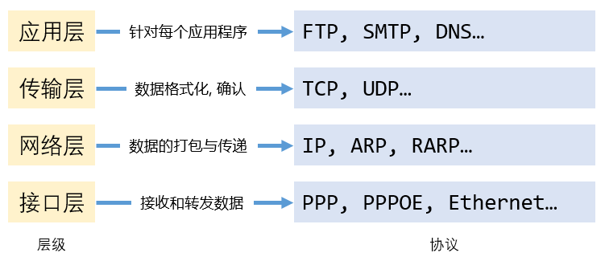

# .NET Core Socket 网络编程, 第〇章 - 基础

随着计算机网络的日益普及, 各种计算机网络应用程序已渗透到人们生活的方方面面, 因而使得网络程序开发成为了应用程序开发的一个重要方向. 而 .NET Core 是一个通用的开放源代码开发平台, 可以使用多种编程语言针对 *x64*, *x86*, *ARM32* 和 *ARM64* 处理器创建适用于 Windows, macOS 和 Linux 的 .NET Core 应用, 非常适合开发各类网络应用程序.

## 网络通信模型

根据计算机之间数据的通信方式, 可以将通信模型分为 `集中式` 和 `分布式` 两类.

### 集中式

在 `集中式` 网络中, 通常由一台主计算机保存和共享数据, 被称为 *服务器*. 其它的计算机通过应用程序连接到服务器上进行数据交换, 这些计算机被称为 *客户端*.

### 分布式

`分布式` 网络是由多个连接在一起的计算机组成, 这些计算机之间相互交换数据和分享资源. 在网络中, 它们既作为 *服务器* 向其它计算机提供服务, 也作为 *客户端* 向其它的计算机请求服务.

不同的网络通信模型在物理结构上基本相同, 主要区别是在软件设计层面上.

## 网通通信架构

网络通信架构是计算机应用程序根据网络通信模型的不同而设计的不同的通信架构, 网络通信架构一般分为 `C/S 结构`, `B/S 结构`, `P2P 结构`.

### C/S 结构

`C/S 结构` 即客户端 / 服务端结构. 现在大多数应用程序都是这种模型, 它将网络事务的处理部分分为客户端和服务端; 其中客户端主要负责界面显示, 人机交互; 服务端主要负责数据的处理与存储.

### B/S 结构

`B/S 结构` 即浏览器 / 服务器结构. `B/S 结构` 是随着互联网技术的发展而对 `C/S 结构` 的改良, 其与 `C/S 结构` 无本质区别, `B/S 结构` 采用 HTTP 协议在客户端和服务端之间进行通信.

### P2P 结构

`P2P 结构` 是对等互联的模型. 在 `P2P 结构` 的网络中, 计算机之间具有相同的功能, 无主从之分, 任何一台计算机既是服务端, 也是客户端.

## TCP/IP 网络模型与协议

`TCP/IP 网络模型` 即 Transmission Control Protocol / Internet Protocol (传输控制协议 / 网际协议) 参考模型. 是互联网的基础, 它将网络功能自上而下地划分为 `应用层`, `传输层`, `网络层` 和 `网络接口层`. 每一层的功能由一系列网络协议去实现. 如图所示:

`TCP/IP 网络模型` 采用自顶而下的分层结构, 每一层都依赖于下一层所提供的功能.

- 应用层, 即最高层. 负责每一个应用程序之间的交流, 例如浏览器与服务器的网站之间采用 HTTP 协议交换数据.

- 传输层, 管理计算机之间的数据交换, 主要由 `传输控制协议` (TCP) 和 `数据报文协议` (UDP) 实现.

- 网络层, 负责地址管理与路由选择, 提供最基本的数据打包与传送功能.

- 网络接口层, 负责字节流与电信号之间的转换, 信号的传输.
