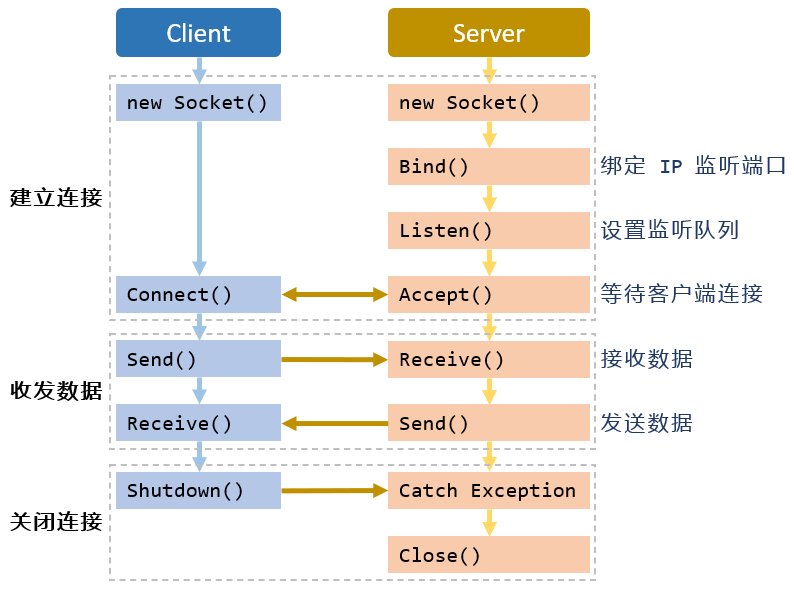

# .NET Core Socket 网络编程, 第四篇 - 面向有连接的网络编程初窥: 使用 TCP

TCP (传输控制协议) 是基于建立连接的 Socket 而进行通信. 在本篇将演示如何使用 Socket 在两个 IP 终结点之间建立连接, 并相互发送消息. 如下图所示, 展示了客户端与服务端基于连接的通信的一般过程:

客户端和服务端两边的步骤有所差异, 根据面向连接的 Socket 通信流程图, 总结基本步骤如下:

- 服务端:
  
  1. 新建一个服务端 Socket 对象, 用于绑定和监听客户端发起的连接.
  2. 新建一个 IP 终结点, 其中包含了服务端的 IP 地址和端口. 然后服务端 Socket 对象使用 `Bind` 方法绑定它.
  3. 服务端 Socket 对象调用 `Listen` 方法, 服务端开启监听.
  4. 服务端 Socket 对象调用 `Accept` 方法, 等待客户端的连接. 此时, 将一直处于阻塞状态, 直到有新的客户端连接.
  5. 一旦有客户端连接到服务端, `Accept` 方法将创建一个新的 Socket 对象, 它包含了服务端/客户端的信息和协议.
  6. 使用 `Accept` 方法新建的 Socket 对象调用 `Receive` 或 `Send` 方法和客户端通信.
  7. 使用结束之后断开连接, 并释放 Socket.

- 客户端:

  1. 新建一个客户端 Socket 对象, 用于连接服务端.
  2. 使用 `Connect` 方法连接服务端的 IP 终结点.
  3. 调用`Receive` 或 `Send` 方法和服务端进行通信.
  4. 使用结束之后断开连接, 并释放 Socket.

## 服务端实现

## 客户端实现
