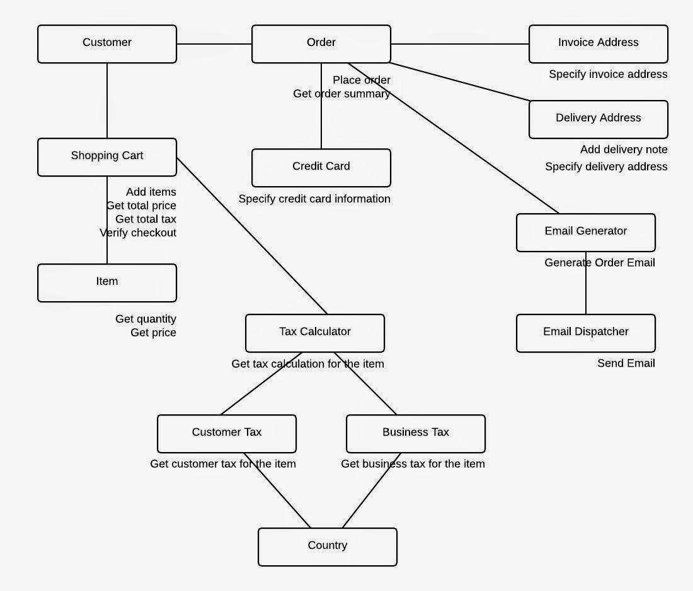
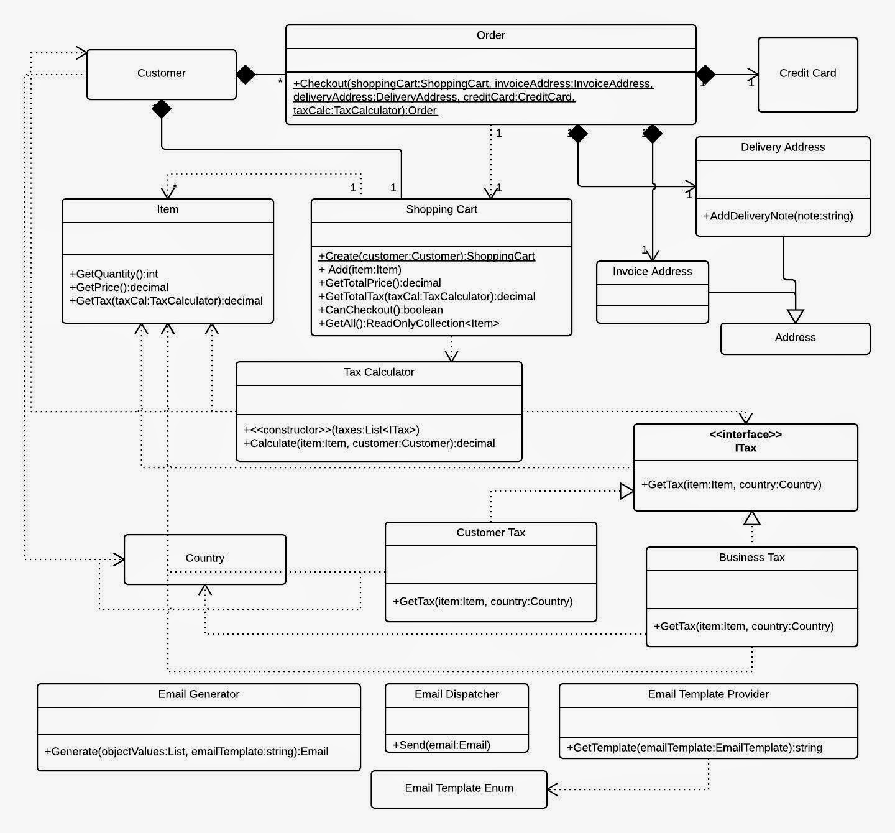

# 应用领域驱动设计, 第〇章 - 需求和建模 (Applied Domain-Driven Design (DDD), Part 0 - Requirements and Modelling)

原文: [Applied Domain-Driven Design (DDD), Part 0 - Requirements and Modelling](http://www.zankavtaskin.com/2014/12/applied-domain-driven-design-ddd-part-0.html)

> About a year ago I have written a series of articles about Domain-driven design, you can find the [main article here](http://www.zankavtaskin.com/2013/09/applied-domain-driven-design-ddd-part-1.html). Looking back I've realised that I've committed the most typical mistake and started to code my business domain without requirements or any draft designs!

大约在一年前¹, 我写过一系列有关领域驱动设计的文章², 你可以在这里找到它的[开篇章节](http://www.zankavtaskin.com/2013/09/applied-domain-driven-design-ddd-part-1.html). 回顾过去, 我意识到自己犯了最典型的错误, 最开始, 在没有需求设计和任何设计草案的情况下, 就对我的业务领域开始写代码了!

## 1. 为此, 我打算尝试修复这个问题, 以下是我准备要做的 (I am going to try and fix this, this is what I am going to do)

- 识别用户故事 (Identify User Stories)
- 识别用户故事的名词 (Identify the Nouns in the user stories)
- 识别用户故事的动词 (Identify the Verbs in the user stories)
- 组合对象交互关系图 (Put together object interaction diagram)
- 组合对象职责关系图 (Put together object responsibilities diagram)
- 组合类的 UML 图, *仅仅显示有趣的交互*. (Put together class digram UML *showing only interesting interactions*)

## 2. 这是我虚构的一些用户故事 (So here are made up user stories)

> - As a customer I want to be able to put products that I want to purchase in to the shopping cart so that I can check out quickly later on

- 作为客户, 我希望能够将想要购买的产品放进购物车, 以便以后可以快速结账.

> - As a customer I want to see the total cost all for all of the items that are in my cart so that I see if I can afford to buy everything

- 作为客户, 我希望知道购物车里 **所有** 商品的总费用, 以便知道是否有能力购买所有的商品.

> - As a customer I want to see the total cost of each item in the shopping cart so that I can re-check the price for items

- 作为客户, 我希望知道购物车里 **每件** 商品的总费用, 以便我重新检查商品的价格.

> - As a customer I want to see the total cost for all of the items in the shopping cart with total tax

- 作为客户, 我希望看见购物车里所有商品的总费用和总税额.

> - As a customer I want to be able to specify the address of where all of the products are going to be sent to

- 作为客户, 我希望能够指定所有商品将要发货的收货地址.

> - As a customer I want to be able to add a note to the delivery address so that I can provide special instructions to the postman

- 作为客户, 我希望能够为交付地址添加备注, 以便于我能提给邮递员供特殊说明.

> - As a customer I want to be able to specify my credit card information during check out so that I can pay for the items

- 作为客户, 我希望能够在结账的时候指定我的信用卡资料, 以便于我可以支付商品.

> - As a customer I want system to tell me how many items are in stock so that I know how many items I can purchase

- 作为客户, 我希望系统能够告诉我库存数量, 这样我就知道可以购买多少个商品了.

> - As a customer I want shopping cart to check that items are still available for purchase during a check out so that I can still purchase items that are in the cart

- 作为客户, 我希望购物车能够在结账时检查商品是否仍旧可以购买, 以便我仍然购买购物车里的商品了.

> - As a customer I want to receive order confirmation email with order number so that I have proof of purchase

- 作为客户, 我希望能够接收到带有带单号的订单确认邮件, 以便于我获得购物证明.

> - As a customer I want to specify invoice address for the order so that I can receive invoice for the order

- 作为客户, 我希望能够指定订单的发票地址, 便于我能接收到订单的发票.

> Now I am going extract nouns and verbs from the stories above. I am looking for the nouns that will become my main objects and not the attributes.

现在, 我将开始从上述故事中提取名字和动词了. 我在寻找那些将成为主要对象非是属性的名词.

## 3. 名词 (Nouns)

- 客户 (Customer)
- 商品 (Item)
- 订单 (Order)
- 购物车 (Shopping Cart)
- 收货地址 (Address)
- 发货单 (Invoice)
- 交付 (Delivery)
- 税费 (Tax)
- 信用卡资料 (Credit Card Information)

> *Note: I've removed duplicates for better, more official names, for example Item = Product, Order = Purchase, etc.

*注意: 为了更好, 更正式的名称; 我把重复的名词已经删除了, 比如 商品 (Item) = 产品 (Product), 订单 (Order) = 采购 (Purchase), 等等.

## 4. 动词 (Verbs)

- 将产品添加到购物车. (Put products in to the shopping cart)
- 查看所有商品的总费用. (See total cost for all of the items)
- 查看每个商品的总费用. (See total cost for each item)
- 查看在自己国家的总税金. (See total tax for my country)
- 设定交付地址. (Specify delivery address)
- 为送货地址添加发货单. (Specify delivery note for delivery address)
- 设定发票地址. (Specify invoice address)
- 接收订单的发票. (Receive invoice for the order)
- 发送发票. (Sent invoice)
- 设定信用卡资料. (Specify credit card information)
- 为商品付款. (Pay for the items)
- 告诉我商品有多少商品. (Tell me how many items are in stock)
- 在结账的时候检查商品是否可用. (Check that items are still available during check out)
- 接收订单的确认邮件. (Receive order confirmation email)d

> By using above nouns and verbs we can put together a diagram such as this:

通过使用以上的名词和动词, 我们能够组合出像下面这样的一个关系图:

**图一: 对象交互图*

> Once we have object interaction diagram we can start thinking about object responsibilities. One of the most common mistakes is to push responsibilities on to the actor object i.e. Customer. We need to remember that objects must take care of themselves and objects need to be closed for direct communication and that you need go through the functions to communicate with them.

一旦我们有了对象交互关系图, 我们就能够开始思考对象职责了. 最常见的错误之一是将职责推给参与者即客户. 我们应该牢记, 对象必须自己照顾自己, 对象需要对直接通信进行封闭, 而是通过函数与他们通信.

> So let's follow above approach and assign responsibilities:

让我们遵循上面的方式来分配职责:

**图二 对象职责图*

> Now that we have object interaction and responsibilities diagram in place we can start thinking about lower level UML class diagram:

现在已经有了对象交互图和职责图, 我们可以开始考虑更低级别的 UML 类图了:

**图三 UML 类图*

> Figure 3 shows methods, class names, dependencies, interfaces and composition. I've took a bit of time and reflected only on the most complex / interesting parts of the model. I will worry about attributes and other details later on, detail will naturally emerge when I start coding. Figure 3 is suppose to be a rough sketch, that is all, teams can whiteboard Figure 3 during a meeting, take a picture and distribute it to everyone in the team and get on with the actual coding. After a week or so picture will be forgotten and the parts of the above model (that have been useful) will live and breath in the actual code.

图三展示了方法, 类名, 依赖项, 接口和组合. 我花了一些时间, 只考虑了模型中最复杂最有趣的部分. 稍后我将考虑属性和其它细节. 当我开始编码时, 细节会自然而然地浮现. 假设图三是个粗略的草图, 也就是说, 团队可以在会议期间, 在白板上画出图三, 拍照并分发给团队中的每个人, 然后开始实际编码. 大约一周后, 图片就会被遗忘, 并且上面模型的部分 (有用的部分) 就会在实际的代码中起到作用.

> Now my made up user stories can be modelled in my many different ways and Figure 3 is just my interpretation of it. Key thing is to think about what you are building first, don't just jump in and start coding and don't get carried away with detail either (attributes, constructors, etc) *focus on interesting and complex parts first*.

现在, 我可以用多种不同的方式对虚构的用户故事进行建模, 图三就是我对它的解释. 事情的关键是, 首先你要思考将要构建什么, 不要一头扎进去就开始写代码, 更不要被属性, 构造方法等细节所迷惑, **先关注复杂且有趣的部分**.

## 5. 总结 (Summary)

> - Don't start doing anything until you have requirements, if you don't have a BA in the company that's fine, you will have to do BA's job and identify requirements first.

- 在有需求之前, 不要开始做任何事. 如果你在公司不是 BA³ 也没关系, 你先做好 BA 的工作, 再明确需求.

> - Don't just jump in to the code soon as you have requirements, put together object interaction and responsibilities diagrams first.

- 切勿一有需求就直接扎进代码里, 先把对象交互和职责图放在一起.

> - When you have identified your objects, interactions and responsibilities use UML class diagrams to put together a draft model (whiteboard sketch will do).

- 当你已经确定了你的对象, 交互和职责; 就可以使用 UML 类图来组合一个模型草稿(白板草图就可以了)。

> - Don't try to model the reality of the world, model the reality of your organisation. Different companies will have different objects, in one company "address" might be an object and you might have "address type" coming of it (invoice, shipping, etc), in another company there will be "invoice address", "shipping address" and "seller address" object, that company might need these objects as these objects will inherit from the base "address" object. *Remember it is all about your business domain and not the actual "reality"*.

- 不要试图模拟现实世界, 而是要根据组织去建模. 不同的公司具有不同的对象, 一家公司 "地址" 可能是一个对象, 而你可能会有 "地址类型" (发票, 运费等). 在另一个公司会有 "发票地址", "送货地址" 和 "卖方地址" 对象, 此公司可能需要这些对象, 因为这些对象将从基本的 "地址" 对象继承, **请记住, 这全都与业务领域有关, 而不是实际的 "现实"**.

## 6. 一些有用链接 (Useful links)

- [净化的 UML (UML Distilled)](http://www.amazon.co.uk/UML-Distilled-Standard-Modeling-Technology/dp/0321193687)
- [双调度模式 (Double Dispatch Pattern)](http://lostechies.com/jimmybogard/2010/03/30/strengthening-your-domain-the-double-dispatch-pattern/)
- [关于 UML 你需要知道的一切 (All UML you need to know)](http://www.cs.bsu.edu/homepages/pvg/misc/uml/)
- [对象 (Objects)](https://www.youtube.com/watch?v=RqnoT5krAJ4)
- [类的关系 (Class Relationships)](https://www.youtube.com/watch?v=YgiePdx115w)
- [类的职责 (Class Responsibilities)](https://www.youtube.com/watch?v=qsHgCoJqU0A)

## 7. 脚注

[1] 本文作者写于 2014 年 12 月.

[2] 此系列将陆续译出.

[3] BA, Business Analyst, 业务分析师. 在 IT 公司里, BA 的角色就是PM (产品经理), 叫 BA 是因为这类 PM 要承接某个很具体的业务或者领域.
